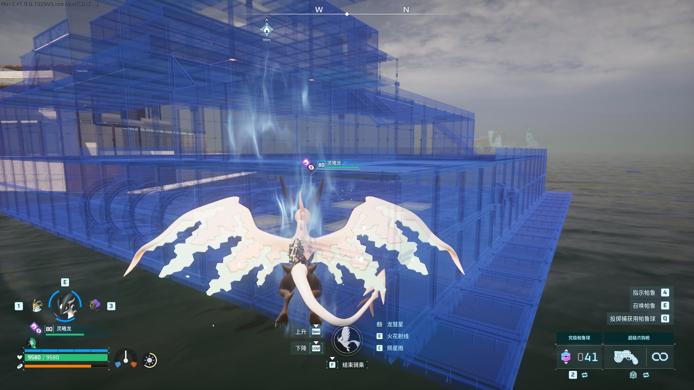
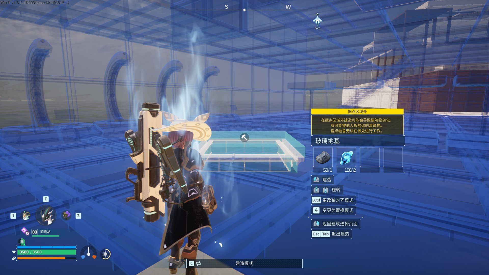
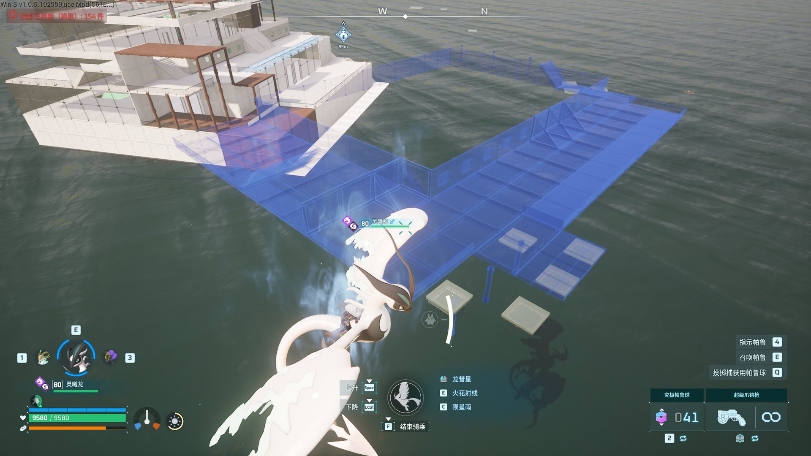

# PWProjection

**Palworld 建筑投影模组（Litematica 风格）** —— 把盖好的基地采集成蓝图，在任何存档里以半透明蓝色全息投影显示出来，照着它一块一块盖回去；**放下建筑的那一刻自动吸附到投影对应的位置**，放好的那一件立刻从投影里消失。

**Blueprint projection for Palworld** — capture a base into a plain-JSON blueprint, project it as a translucent hologram in any save, and rebuild it piece by piece. Every piece snaps to its matching hologram position automatically, and placed pieces vanish from the hologram.


| 平台 | 链接 |
|---|---|
| Steam 创意工坊 | <https://steamcommunity.com/sharedfiles/filedetails/?id=3815752136> |
| Nexus Mods | <https://www.nexusmods.com/palworld/mods/5899> |
| 演示视频（bilibili） | <https://www.bilibili.com/video/BV1PHHy6pEnz/> |

---

## 演示





## 功能

- **采集 → 蓝图**：站进基地按 `Y`，把建筑存成纯 JSON 蓝图（可备份、可编辑、可分享；采集半径可调，`0` = 全部）。
- **投影**：按 `J` 加载蓝图，按 `K` 放下 / 收起蓝色投影。
- **建造吸附**：**不需要额外按键**。正常放置就行，位置 / 朝向 / 高度都会对到投影上；游戏拒绝了会给出原因，并自动把投影高度挪到"游戏允许的位置"。
- **分层显示**：按 `L` 一层一层看蓝图。
- **已放好的不再画**：建好的部分自动从投影里消失，拆掉会自动恢复显示。
- **位置与进度记忆**：按蓝图记住"上次投影放在哪、建到哪"；在附近重开蓝图会接着上次的进度（一张蓝图可存多处放置记录）。
- **游戏内设置页**（可选，需 Mod Options Framework）：改键、采集半径、微调步长、旋转步长、分层间距。
- **纯 Lua + 全中文日志**：`Scripts\pwpr.log` 每步都有说明，出问题好定位。

## 安装

### ① 创意工坊（最省事）
订阅 → 游戏里 `Options → Mod Management` 启用 → 进世界按一次 `N`（渲染能力探测，第一次必须跑）。

### ② Nexus Mods / Vortex
在页面上点 **Mod manager download**（Vortex 会自动识别 Lua 模组），或手动下载压缩包按下一条装。

### ③ 手动
1. 先装 **UE4SS**（RE-UE4SS / UE4SS Experimental）。
2. 把压缩包里的 `PWProjection` 文件夹放到
   `<Palworld>\Mods\NativeMods\UE4SS\Mods\PWProjection\`（里面要有 `Scripts\main.lua`）。
3. 在 `<Palworld>\Mods\NativeMods\UE4SS\Mods\mods.txt` 里加一行：`PWProjection : 1`
4. 重启游戏 → 进世界 → **按一次 `N`**。

## 按键

| 键 | 作用 | 默认 |
|---|---|---|
| `N` | 渲染能力探测（第一次必须跑；通过后解锁投影）| 已绑定 |
| `Y` | 采集：把当前建筑存成蓝图 | 已绑定 |
| `J` | 加载蓝图 | 已绑定 |
| `K` | 投影 放下 / 收起 | 已绑定 |
| `L` | 分层显示 | 已绑定 |
| `H` | 把投影重新定位到脚下 | 不绑定（设置页里设）|
| `U` | 换一处放置记录 | 不绑定 |
| `F9` | 方向键模式（移动 / 旋转 / 换材质）| 不绑定 |
| `F7` | 帮助 / 状态 | 不绑定 |
| `F8` | 重载配置 | 不绑定 |

小键盘 `8/2/4/6/9/3` 微调、`+/-` 旋转、`5` 复位、`0` 换步长 —— 可选别名，没有小键盘也能用方向键。

## 配置

- **游戏内**：`Esc → Mod Options → PWProjection`（需 Mod Options Framework）。
- **配置文件**：`Scripts\pwpr_config.json`（只写与默认值不同的键；按 `F8` 即时生效）。
  全部键与默认值见 **[docs/配置说明.md](docs/配置说明.md)**。
- **按键文件**：`Scripts\pwpr_keys.json`（只管按键，有注释与规则）。
- **数据文件**（可安全备份 / 删除）：`pwpr_placements.json`（位置与进度记忆）、`pwpr_meshmap.json`（网格映射）、`blueprints\*.blueprint.json`（蓝图）。

> ⚠️ **已知问题：改键之后不要快速连点"保存"**
> 每次保存都会**重载本模组**，而改键这条路会让设置框架反复重载（实测约 0.44 秒一轮），
> 几十轮后游戏可能卡死。改完点**一次**保存、等生效再改下一项；**不改内容**时随便点（不会重载）。
> 万一卡住：结束进程重开即可 —— 配置 / 键位 / 建造进度都**不会丢**。
> 想彻底避开：`pwpr_config.json` 里加 `"options_apply_mode": "game_restart"`（保存不再重载，只提示重启游戏）。

## 已知限制

- 投影**不跟随**玩家 —— 放在哪就在哪（按 `H` 重新定位到脚下）。
- 拼装类建筑（发电机、生产设备等）只画主体。
- `blueprint` 模式（整体基地一键采集）尚未完成，请用普通采集。
- **联机未验证**（单机为主）。
- 偶发崩溃仍在排查中；遇到请带上 `Mods\NativeMods\UE4SS\crash_*.dmp` 与 `Scripts\pwpr.log` 反馈。

## 排错

1. **先看构建标记**：日志第一行（或 `F7`）写着 `2026-xx-xx.NNN` —— 确认跑的是哪一版。
2. **日志**：`<Palworld>\Mods\NativeMods\UE4SS\Mods\PWProjection\Scripts\pwpr.log`
   （每行带时间戳；`[bsnap]` = 建造吸附，`[fill]` = 投影构建，`[keys]` = 按键绑定）。
3. **按键没反应**：可能没绑定（设置页里设）或改键后需要重启游戏。
4. **吸附没生效**：看日志 `[bsnap]` 那几行给的原因（太远 / 类型不匹配 / 游戏拒绝）；最常见是投影本身放歪了 ⇒ 按 `H`。
5. 常见问题完整清单见 [docs/发布/安装与使用.md](docs/发布/安装与使用.md)。

## 开发 / 从源码构建

```powershell
# 部署到游戏目录（把 Scripts 复制进 UE4SS 的 Mods\PWProjection）
.\mod\PWProjection\deploy.ps1

# 静态检查（改完 Lua 必须全绿）
python tools\luacheck.py mod\PWProjection\Scripts      # 24 文件 0 问题
python tools\selftest.py ; python tools\buildsnap_sim.py ; python tools\snap_sim.py
python tools\resume_sim.py ; python tools\check_keys.py ; python tools\check_config_doc.py
python tools\check_bom.py ; python tools\_linkcheck.py
powershell -NoProfile -ExecutionPolicy Bypass -File tools\check_ps_syntax.ps1

# 打包发布产物（工坊包 + Nexus zip）
powershell -NoProfile -ExecutionPolicy Bypass -File tools\make_release.ps1
```

```
mod/PWProjection/
├── Scripts/          ← 模组本体（24 个 .lua + 网格映射表）
├── blueprints/       ← 采集出来的蓝图（用户数据）
├── workshop/         ← 工坊元数据（Info.json + 缩略图）
├── deploy.ps1        ← 部署到游戏目录
└── third_party/      ← 第三方文件许可说明
tools/                ← 检查器 / 模拟器 / 打包脚本（Python + PowerShell）
docs/                 ← 文档（配置说明 / 踩坑记录 / 发布资料）
```

各文档分工：**[docs/当前行为总览.md](docs/当前行为总览.md)**（这一版到底是什么行为）·
**[docs/配置说明.md](docs/配置说明.md)**（每个配置键）· **[docs/踩坑记录.md](docs/踩坑记录.md)**（实测踩过的坑与结论）·
**[docs/发布/](docs/发布/)**（页面文案 / 更新日志 / 发布与更新流程）。

## 致谢

- **[UE4SS](https://github.com/UE4SS-RE/RE-UE4SS)** —— 本模组运行的 Lua 运行时（**未随包分发**）。
- **Mod Options Framework**（作者 **Elvlin**，MIT）—— 游戏内设置页；按许可在 `third_party/` 内转发两个 SDK 文件，许可见 [third_party/README.md](mod/PWProjection/third_party/README.md)。
- **Simple Building Blueprints (SBB)** —— 架构参考（只读），**未复用任何代码或字符串**。

## 许可证

**MIT** —— 见 [LICENSE](LICENSE)（`Copyright (c) 2026 CitrusDR`）。可自由使用、修改、转载，保留署名即可。

---

作者：**CitrusDR**（bilibili：**柑橘味快乐水**）
问题反馈：本仓库 [Issues](https://github.com/CitrusDR/PWProjection/issues) 或对应平台的评论区。
